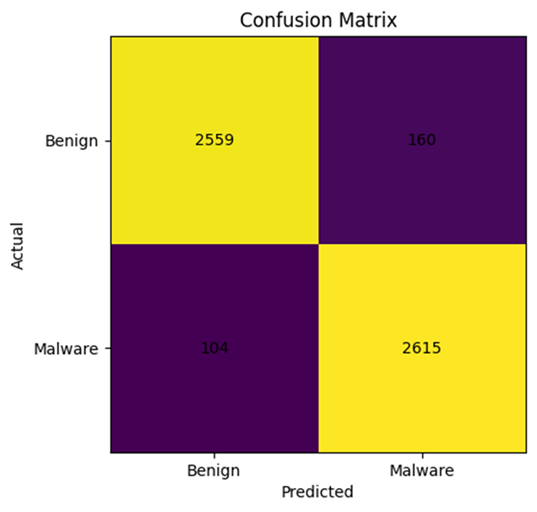
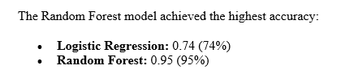
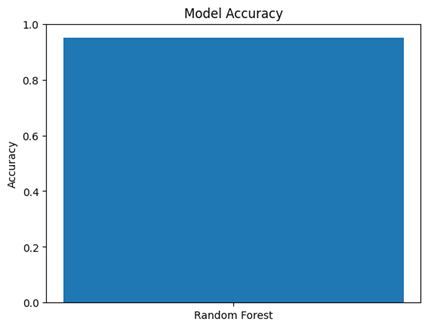

# ransomware-ml-static-features

Machine learning-based ransomware detection using static file features (Logistic Regression and Random Forest).

---

## Project Overview

Ransomware continues to be one of the most damaging forms of malware, capable of encrypting victim files and disrupting organizations and individuals. This project explores a **machine learning (ML) approach to ransomware detection using static features**, meaning the model does not need to execute the file to make a prediction.

The main objective is to evaluate whether static file-based indicators can effectively distinguish ransomware from benign software using supervised ML classifiers.

---

## Goals

- Detect ransomware using **static file features**
- Train and compare two ML models:
  - **Logistic Regression (LR)**
  - **Random Forest (RF)**
- Measure performance using standard classification metrics
- Provide a clean reproducible structure for future expansion (more models, more features, more datasets)

---

## Why Static Features?

Static analysis is attractive because:
- It does **not require executing** potentially harmful binaries
- It can be applied quickly at scale
- It supports early detection workflows

Examples of static indicators may include:
- File size patterns
- Section/header metadata (PE characteristics)
- Entropy measurements
- Imported API patterns
- String and opcode patterns (depending on dataset)

> **Note:** This repo focuses on the ML pipeline and evaluation methodology. Feature selection depends on the dataset used in the report.

---

## Models Implemented

### 1) Logistic Regression (LR)
A strong baseline linear classifier that performs well in binary classification tasks.

### 2) Random Forest (RF)
An ensemble method that combines multiple decision trees to improve robustness, capture non-linear patterns, and reduce overfitting.

## Repository Structure

~~~
ransomware-ml-static-features/
├── report/                # Final report document (DOCX)
├── src/                   # Source code (training + evaluation scripts)
├── results/               # Output figures (confusion matrix, plots) [optional]
├── .gitignore
├── LICENSE
├── README.md
└── requirements.txt
~~~

## Installation

### 1) Clone repository
~~~bash
git clone https://github.com/Recon53/ransomware-ml-static-features.git
cd ransomware-ml-static-features
~~~

### 2) Install dependencies
~~~bash
pip install -r requirements.txt
~~~

Dependencies include:
- numpy
- pandas
- scikit-learn
- matplotlib

## Usage

### Run in demo mode (no dataset required)
This will generate a synthetic dataset and train/test both models.

~~~bash
python src/train_models.py
~~~

### Run with your dataset (CSV)
Provide a path to your dataset and the label column name.

~~~bash
python src/train_models.py --data path/to/your_dataset.csv --label-col label
~~~

### Output
The script prints classification metrics (Accuracy, Precision, Recall, F1) and saves confusion matrix figures to:
- `results/confusion_matrix_logistic_regression.png`
- `results/confusion_matrix_random_forest.png`

---

## Results (Sample)

### Confusion Matrix (Random Forest)

### Accuracy (Logistic Regression vs Random Forest)

### Top Features (Random Forest)

