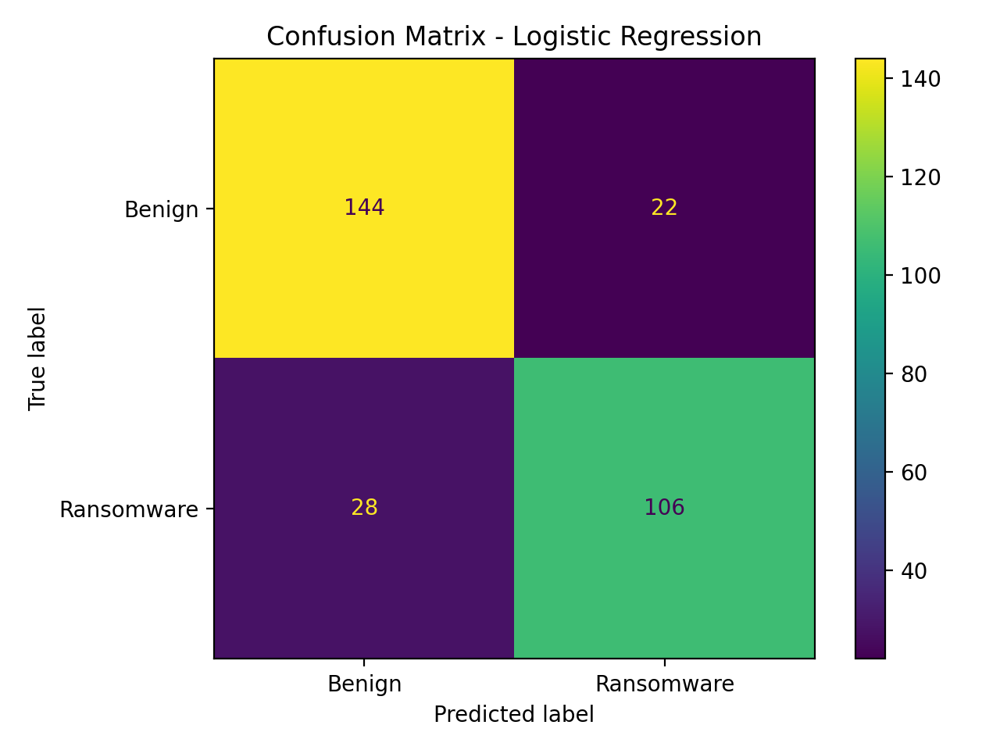
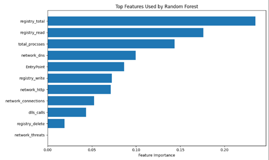

# ransomware-ml-static-features

[](https://www.python.org/)
[](https://scikit-learn.org/stable/)
[](LICENSE)
[](https://github.com/Recon53/ransomware-ml-static-features/releases/tag/v1.0)
[](https://doi.org/10.5281/zenodo.18209938)


## Quick Start
~~~bash
pip install -r requirements.txt
python src/train_models.py
~~~


Machine learning-based ransomware detection using **static file features**, evaluating **Logistic Regression** and **Random Forest** classifiers.

---
### Run with your own dataset (CSV)

python src/train_models.py --data data/your_dataset.csv --label-col label

## Evaluation Metrics

- Accuracy
- Precision
- Recall
- F1-score
- Confusion Matrix

---

## Results (Demo Run)

- Logistic Regression Accuracy: ~0.83
- Random Forest Accuracy: ~0.94  
Random Forest performed better overall in this baseline experiment.

---

## Project Overview

Ransomware remains one of the most damaging categories of malware, capable of encrypting victim files and disrupting individuals and organizations.  
This project explores a **machine learning (ML) approach** to ransomware detection using **static features**, meaning the model does **not** need to execute the file to make a prediction.

The goal is to evaluate whether static indicators can effectively distinguish ransomware from benign software using supervised ML classifiers.

---

## Repository Structure

~~~
ransomware-ml-static-features/
├── report/                      # Final report document (DOCX)
├── src/                         # Source code (training + evaluation scripts)
├── results/                     # Output figures (confusion matrix, plots)
├── .gitignore
├── LICENSE
├── README.md
└── requirements.txt
~~~

---

## Installation

### 1) Clone repository
~~~bash
git clone https://github.com/Recon53/ransomware-ml-static-features.git
cd ransomware-ml-static-features
~~~

### 2) Install dependencies
~~~bash
pip install -r requirements.txt
~~~

Dependencies include:
- numpy
- pandas
- scikit-learn
- matplotlib

---

## How to Run

From the repository root:

### 1) Demo mode (no dataset required)
Generates a synthetic dataset and runs the full pipeline.

~~~bash
python src/train_models.py
~~~

### 2) Run with your dataset (CSV)
Provide a path to your dataset and the label column name.

~~~bash
python src/train_models.py --data path/to/your_dataset.csv --label-col label
~~~

---

## Expected Output

The script prints evaluation metrics such as:
- Accuracy
- Precision
- Recall
- F1-score

It also saves result images into the `results/` folder, including:

- `results/confusion_matrix_random_forest.png`
- `results/model_accuracy_random_forest.png`
- `results/feature_importance_random_forest.png`

---

## Results (Screenshots)

### Confusion Matrix (Logistic Regression)


---

### Confusion Matrix (Random Forest)

### Model Accuracy (Random Forest)


### Top Features (Random Forest)


---

## Citation / Acknowledgements

This project was developed for academic coursework and experimentation using publicly available ML libraries such as scikit-learn.

---

## Citation

If you use this repository, please cite the Zenodo record:

```bibtex
@software{guadalupe_ransomware_ml_static_features_2026,
  author       = {Guadalupe, Miguel},
  title        = {ransomware-ml-static-features},
  year         = {2026},
  publisher    = {Zenodo},
  doi          = {10.5281/zenodo.18209938},
  url          = {https://doi.org/10.5281/zenodo.18209938}
}
