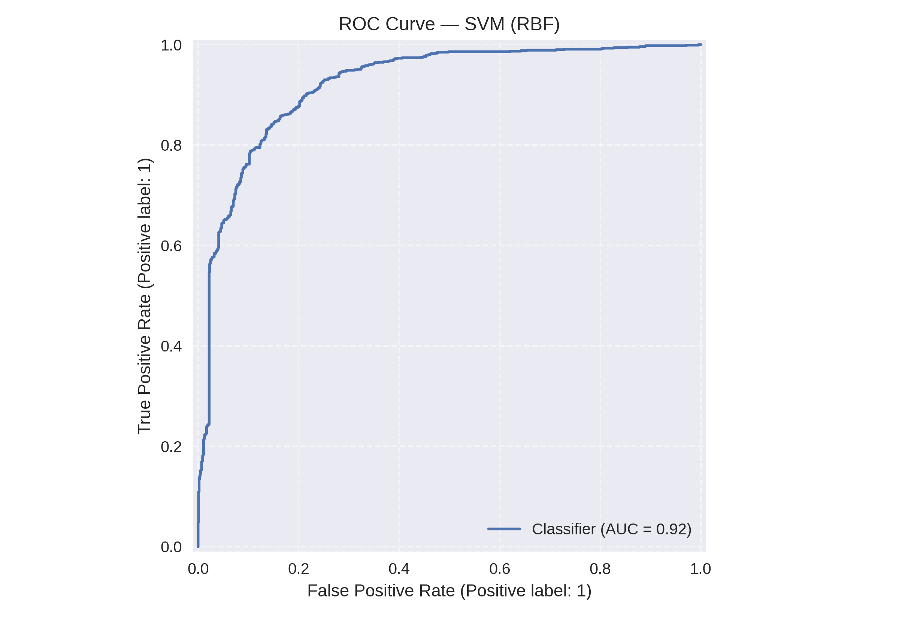
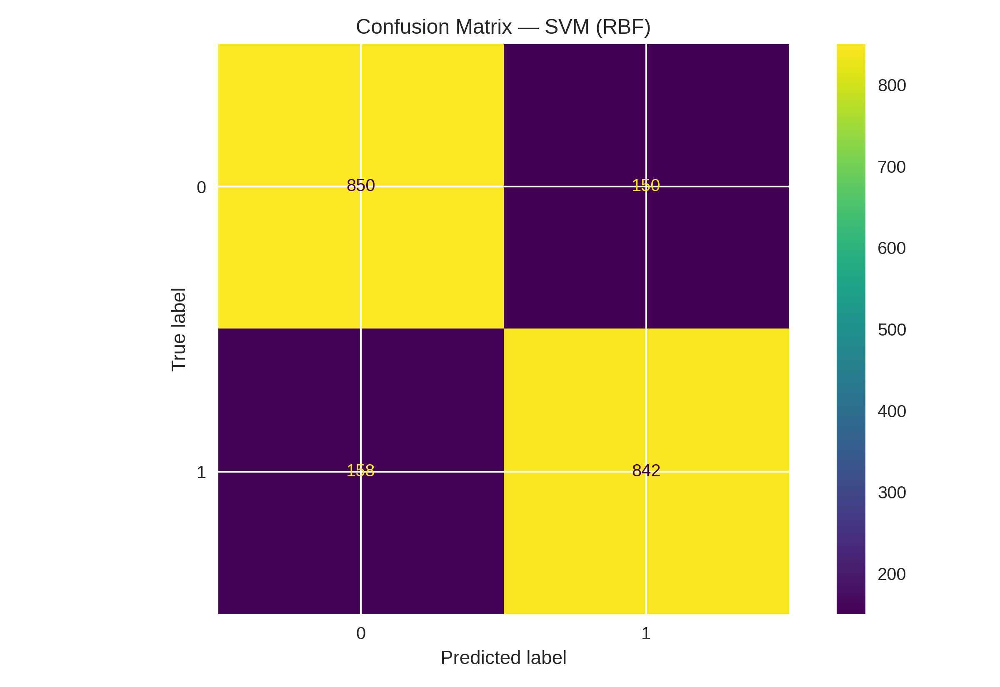
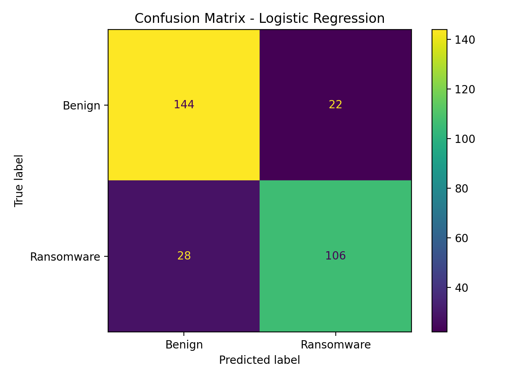
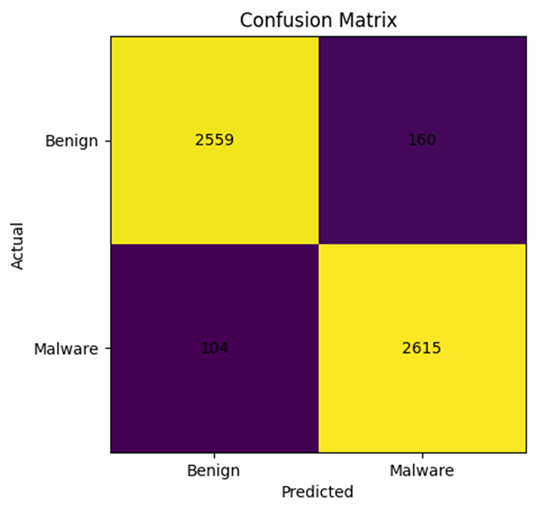
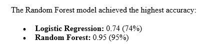
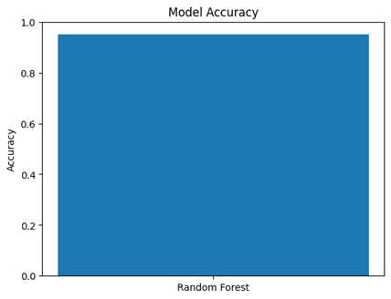

[](https://doi.org/10.5281/zenodo.18209938)

<p align="center">

</p>

<h1 align="center">Ransomware Detection Using Static Machine Learning Features</h1>

<p align="center">
<em>Static PE‑based ransomware detection using supervised machine learning models.</em>
</p>

<p align="center">
<a href="https://www.python.org/"></a>
<a href="https://scikit-learn.org/stable/"></a>
<a href="LICENSE"></a>
<a href="https://github.com/Recon53/ransomware-ml-static-features/releases/tag/v1.0"></a>
<a href="https://doi.org/10.5281/zenodo.18209938"></a>


</p>


# Overview

This project evaluates how effectively static features extracted from Windows Portable Executable (PE) files can distinguish ransomware from benign software using supervised machine learning.

Static analysis is:

Safe — no malware execution

Fast — no sandboxing required

Scalable — suitable for large datasets

This work was developed as part of CAP 5610 – Machine Learning.

Static features used include:

PE header values
Section metadata
Registry activity counters
API/DLL import counts
Network-related statistics

These features enable safe, fast, and scalable detection.

Developed as part of CAP 5610 – Machine Learning.

## Results Preview

### SVM (RBF) Performance
The SVM (RBF) model achieved the strongest overall performance (ROC-AUC: 0.9738), demonstrating excellent separation between benign and ransomware samples using static PE features.

<p align="center">
  
</p>

<p align="center">
  
</p>

<p align="center"><em>ROC curve (left) and confusion matrix (right) for the SVM (RBF) model</em></p>


## Quick Start
```bash
pip install -r requirements.txt
python src/train_models.py
```
## Notebook

Full workflow available here:  
[Open Notebook](./notebooks/Final_Ransomware_Detection_Notebook.ipynb)

### Run with your own dataset (CSV)

```bash
python src/train_models.py --data data/your_dataset.csv --label-col label


# Dataset

**Ransomware Dataset 2024**

- **21,752 samples**
  - 10,876 benign
  - 10,876 ransomware
- Numeric PE‑based features only
- Preprocessing removed:
  - Hashes  
  - Filenames  
  - Non‑numeric identifiers  

> “These values describe file behavior without needing to run the malware.”


# Models Implemented

Four supervised learning models were trained and evaluated:

- Logistic Regression  
- Random Forest  
- Support Vector Machine (RBF kernel)  
- K‑Nearest Neighbors (k = 5)

Evaluation metrics:

- Accuracy  
- Precision  
- Recall  
- F1‑score  
- Confusion Matrix  
- ROC‑AUC  


## Results

### Model Performance Comparison

| Model               | Accuracy  | ROC-AUC |
| ------------------- | --------- | ------- |
| Logistic Regression | 0.74–0.83 | N/A     |
| Random Forest       | 0.95      | N/A     |
| SVM (RBF)           | 0.94      | 0.9738  |
| K-Nearest Neighbors | ~0.93     | N/A     |

### Key Findings

* **SVM (RBF)** achieved the best overall performance (ROC-AUC: 0.9738)
* **Random Forest** achieved the highest accuracy and strong generalization
* Static features demonstrated strong effectiveness for ransomware detection without requiring file execution

### ROC Curve Highlight

The ROC analysis showed that **SVM (RBF)** delivered the strongest overall class-separation performance, achieving a **ROC-AUC of 0.9738**. This indicates excellent discrimination between benign and ransomware samples using static PE-based features alone.

### Top Features (Random Forest)
- `registry_total`  
- `registry_read`  
- `total_processes`  
- `network_dns`  
- `EntryPoint`

> These results confirm that both ensemble and kernel-based models are highly effective for ransomware detection using static PE features.

# Repository Structure

```
ransomware-ml-static-features/
├── src/                         # Training + evaluation scripts
├── report/                      # Final report (DOCX/PDF)
├── results/                     # Confusion matrices, ROC curves, feature importance
├── presentation/                # Final slide deck
├── assets/                      # Images, diagrams
├── data/                        # Dataset placeholder
├── requirements.txt
├── LICENSE
└── README.md

# Presentation (CAP 5610)

This repository includes the final course presentation and written report for the Machine Learning project **“Detection of Ransomware Using Static Features.”**

### Files Included
- **Slide Deck (PowerPoint):** `presentation/Ransomware_ML_Presentation_Miguel.pptx`
- **Final Report (Word/PDF):** `report/Ransomware_Static_Features_Report.docx`

### Key Takeaway
**Random Forest consistently outperformed Logistic Regression**, supporting ensemble‑based approaches for ransomware detection using static features.

# Installation

### 1) Clone repository
```bash
git clone https://github.com/Recon53/ransomware-ml-static-features.git
cd ransomware-ml-static-features


### 2) Install dependencies
```bash
pip install -r requirements.txt

Dependencies include:

- numpy  
- pandas  
- scikit-learn  
- matplotlib  

---

# How to Run

### 1) Demo mode (no dataset required)
```bash
python src/train_models.py

### 2) Run with your dataset (CSV)
```bash
python src/train_models.py --data path/to/your_dataset.csv --label-col label
```

---

# Expected Output

The script prints evaluation metrics such as:

- Accuracy  
- Precision  
- Recall  
- F1‑score  

It also saves result images into the `results/` folder, including:

- `results/confusion_matrix_random_forest.png`
- `results/model_accuracy_random_forest.png`
- `results/feature_importance_random_forest.png`

# Results (Screenshots)

### Confusion Matrix (Logistic Regression)


### Confusion Matrix (Random Forest)


### Model Accuracy (Random Forest)


### Top Features (Random Forest)


# Conclusion

This project demonstrates that static PE-based features can effectively distinguish ransomware from benign software using classical machine learning models. The SVM (RBF) and Random Forest models delivered the strongest performance, confirming that static analysis remains a powerful, safe, and scalable approach for malware detection.

# Citation / Acknowledgements

This project was developed for academic coursework and experimentation using publicly available ML libraries such as scikit‑learn.

# Citation

If you use this repository, please cite the Zenodo record:

```bibtex
@software{guadalupe_ransomware_ml_static_features_2026,
  author       = {Guadalupe, Miguel},
  title        = {ransomware-ml-static-features},
  year         = {2026},
  publisher    = {Zenodo},
  doi          = {10.5281/zenodo.18209938},
  url          = {https://doi.org/10.5281/zenodo.18209938}
}
```md
# Author

**Miguel Guadalupe**  
Miami Dade College / FIU  
For questions or collaboration, please open an issue in this repository.
